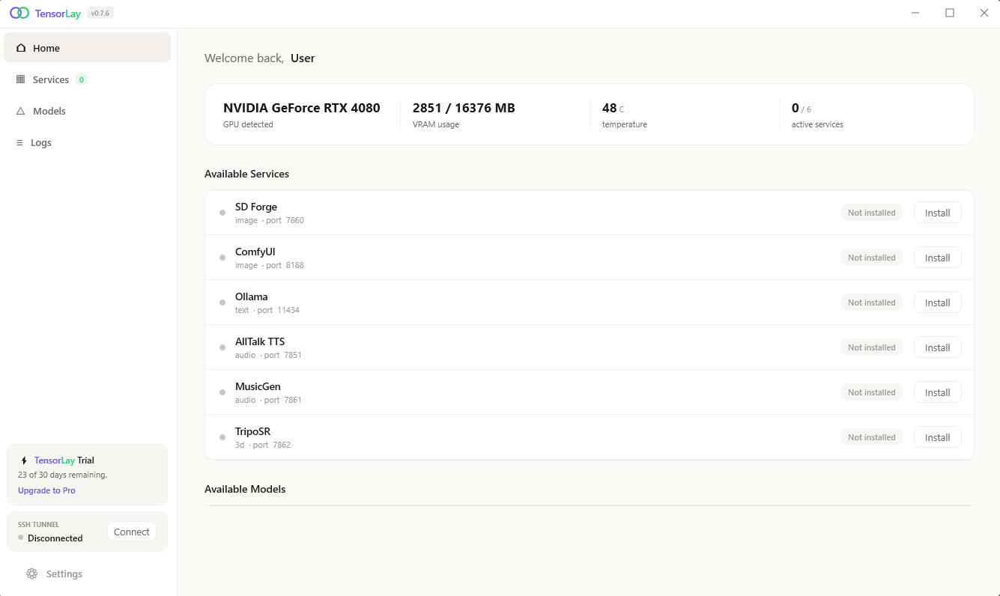

# TensorLay

> Bring your home GPU to the cloud.

TensorLay is a Windows desktop app that tunnels your local NVIDIA GPU to a remote VPS over SSH. AI agents on the VPS — Claude Code, custom workflows, anything that hits `localhost:7860` — can use your home graphics card for image generation, LLM inference, TTS, music, and 3D models.

**Free and open source under the MIT license.** No paid tiers, no subscriptions, no telemetry.

[Download for Windows](https://tensorlay.com/download) · [Documentation](https://tensorlay.com/docs) · [Support development](https://github.com/sponsors/papergallery)



## Quick start

1. **Install TensorLay** on your Windows PC. Download `TensorLay-Setup.exe` from <https://tensorlay.com/download> and run it. Requires Windows 10/11 + an NVIDIA GPU.

2. **Set up your VPS** — run on any Linux server as root:

   ```bash
   curl -sL https://tensorlay.com/install.sh | sudo bash
   ```

   The installer prints an 8-character pairing code.

3. **Pair**: in TensorLay click **Connect**, enter your VPS IP and the pairing code. SSH keys are exchanged automatically — no manual config, no port forwarding.

After pairing, every AI service you start in TensorLay becomes reachable on the VPS at `localhost:<port>`.

## Supported services

| Service     | Port  | What it does |
|-------------|-------|--------------|
| SD Forge    | 7860  | Stable Diffusion image generation |
| ComfyUI     | 8188  | Node-based image pipelines, ControlNet, animation |
| Ollama      | 11434 | Local LLMs — chat, code, vision |
| AllTalk TTS | 7851  | Text-to-speech and voice cloning |
| MusicGen    | 7861  | AI music generation |
| TripoSR     | 7862  | 3D models from images |

## How it works

```
[Your PC]                                       [VPS]
  GPU + AI services                  Claude Code or any agent
       │                                          ▲
       └─────── SSH reverse tunnel ───────────────┘
              (TensorLay manages this)
```

The VPS-side helper is a small FastAPI service ("the relay") that handles pairing and exposes a `/services` endpoint so agents can discover what's available. SSH private keys are generated locally and never leave your machine.

## Project layout

```
app/                    # the desktop application
  TensorLay.sln
  TensorLay/            # main WPF project (.NET 8, MVVM via CommunityToolkit.Mvvm)
  installer.nsi         # NSIS script → TensorLay-Setup.exe
  installer/            # branded installer assets (header, sidebar)
  publish.sh            # one-command build + sign + installer + deploy
relay/                  # what installs on the VPS
  install.sh            # one-command installer (curl -sL https://tensorlay.com/install.sh | sudo bash)
  relay.py              # FastAPI daemon (port 8090) for pairing + service discovery
docs/
  screenshot.png        # the image used at the top of this README
```

The website (`tensorlay.com`) lives in a separate repo.

## Building from source

Requires the .NET 8 SDK. Cross-compile from Linux to win-x64 works.

```bash
cd app
dotnet publish TensorLay/TensorLay.csproj -c Release -r win-x64 \
    --self-contained true \
    -p:PublishSingleFile=true \
    -p:IncludeNativeLibrariesForSelfExtract=true \
    -p:EnableWindowsTargeting=true
```

For the full release build (NSIS installer + code signing), see [`app/publish.sh`](./app/publish.sh) and [CONTRIBUTING.md](./CONTRIBUTING.md).

## Contributing

Bug reports and pull requests are welcome — see [CONTRIBUTING.md](./CONTRIBUTING.md). There's no formal CLA; standard MIT applies.

## Support

If TensorLay saves you money on cloud GPUs, consider sponsoring development on [GitHub Sponsors](https://github.com/sponsors/papergallery). 100% goes to development, infrastructure, and support for more AI services.

## License

MIT — see [LICENSE](./LICENSE).
